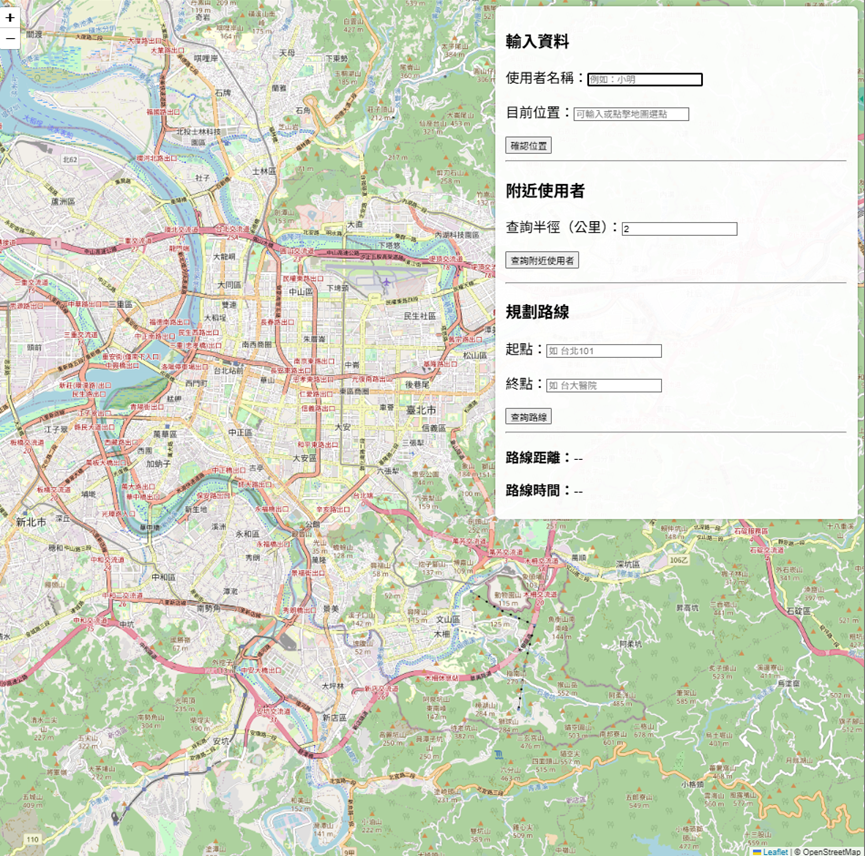
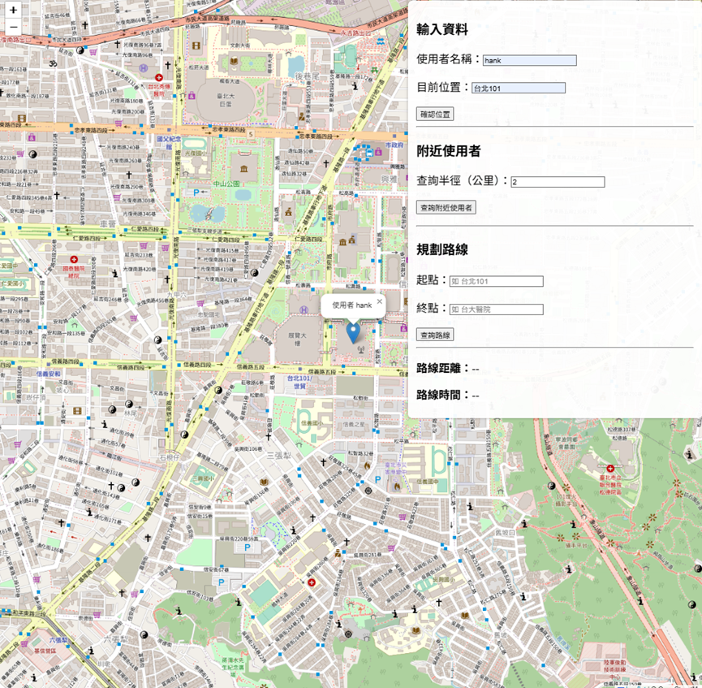
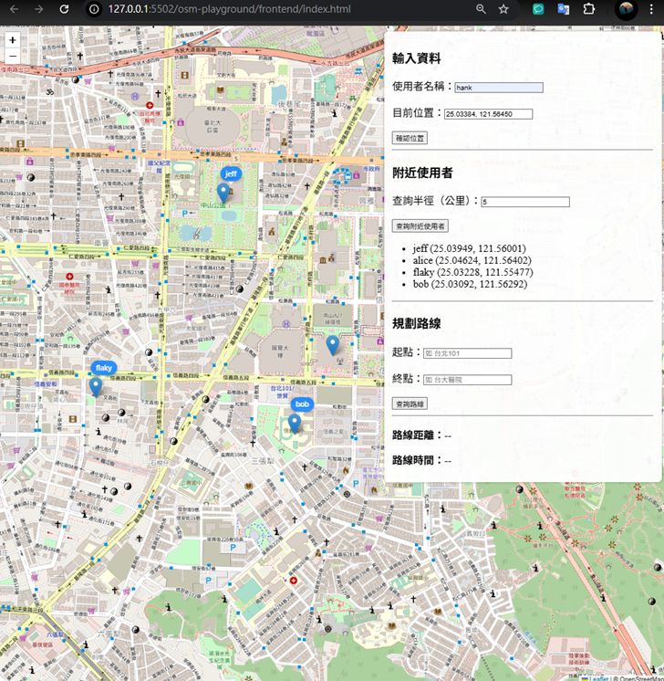
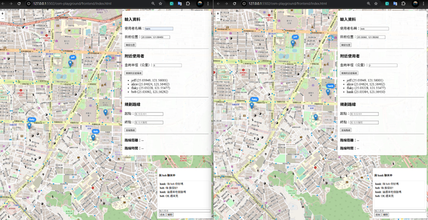
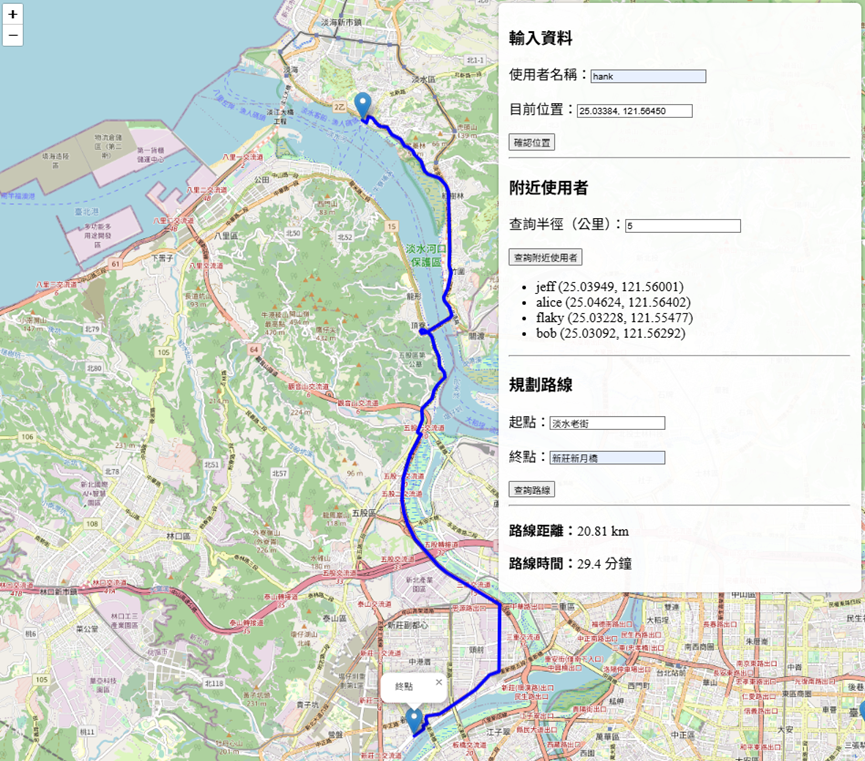
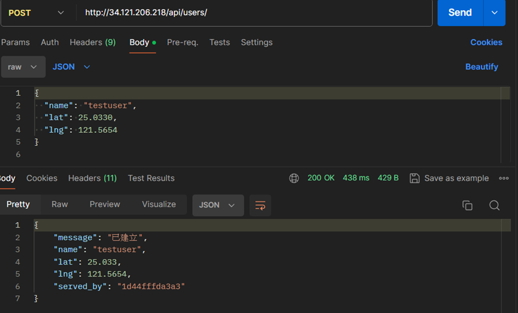
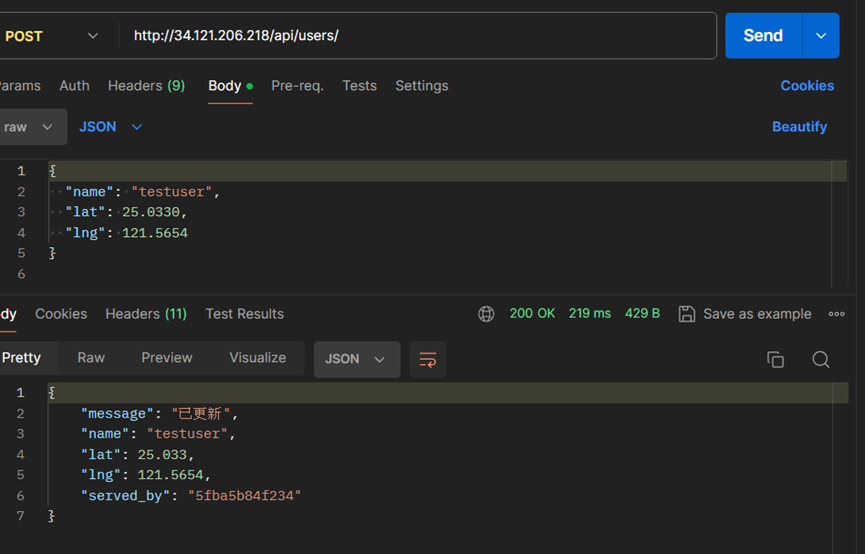

# 🗺️ 台灣導航系統 Taiwan Navigation System

本系統是一套以 Docker 為基礎建構的「台灣地圖導航 + 即時通訊平台」，主要用途為技術練習。功能涵蓋使用者地理定位、鄰近使用者搜尋、WebSocket 即時聊天，以及 A → B 點導航。

---

##  功能說明

-  **使用者建立**：輸入使用者名稱即創建帳號，無需密碼。
-  **使用者定位**：可透過點擊地圖、輸入地址或經緯度座標為使用者設定位置。
-  **鄰近搜尋**：可選擇範圍以顯示附近其他使用者的座標，並標示於地圖上。
-  **即時聊天**：點擊其他使用者後可建立聊天室，支援 WebSocket 即時通訊。
-  **路線導航**：可規劃從 A 點到 B 點的路線，並顯示距離與預估時間。
  
---

##  系統架構

> 本系統需使用 `docker` 及 `docker compose` 進行部署。

- **前端**：純 HTML/CSS/JavaScript，無框架，透過 Nginx 提供服務並代理 API 請求。
- **後端**：Django (含 REST Framework + Channels) 提供 API 與 WebSocket 通訊。
- **資料庫**：
  - PostgreSQL + PostGIS：用於儲存使用者資料與地理資訊。
  - Redis：用於聊天室的 Pub/Sub 機制。
- **地圖服務**：
  - OSRM（Open Source Routing Machine）：提供導航路線規劃。
  - OpenStreetMap Tile Server：作為地圖圖層來源。

---

##  API 概覽

| 功能             | Endpoint 範例 |
|------------------|----------------|
| 建立 / 更新位置  | `POST /api/users/` |
| 查詢附近使用者   | `GET /api/users/nearby/?=<使用者名稱>&radius=<公里>` |
| 傳送聊天訊息     | WebSocket `/ws/chat/<your_name>/<target_name>/` |
| OSRM 導航規劃    | `GET /route/v1/driving/<lon1>,<lat1>;<lon2>,<lat2>?overview=full&geometries=geojson` |

---

##  系統

- Ubuntu 24.04
---

##  套件
---
- Docker
- Docker Compose

---

##  執行

```bash
git clone git@github.com:hanklin0804/navigation-system.git
cd navigation-system/

chmod +x setup.sh
./setup.sh
```

---

 等容器完全啟動後，再執行：
```bash
docker compose exec django python manage.py migrate
```

##  開啟方式 
1. VS Code Live Server
2. 右鍵點選 frontend/index.html → 開啟 Live Server
3. 系統將顯示台灣地圖，支援定位、搜尋、聊天與導航功能

##  資料來源及處理

- 用 **台灣地圖資料**：由 [Geofabrik](https://download.geofabrik.de/) 取得的 `taiwan-latest.osm.pbf` 檔案。
- 系統自動處理以下 OSRM 導航前處理步驟：
  - `osrm-extract`
  - `osrm-partition`
  - `osrm-customize`

---

##  開發補充

Nginx 在系統中扮演角色：

- 📦 **靜態前端資源伺服器**：提供 `index.html`、`app.js`、`style.css` 等前端檔案。
- 🔄 **反向代理伺服器**：
  - 將 `/api/` 請求轉發至 Django REST API。
  - 將 `/ws/` 協議升級為 WebSocket，轉發至 Django Channels。
- ⚖️ **負載均衡器**：
  - 支援多個 Django 實例，透過 `docker compose --scale django=3` 實現後端分流。

##  系統畫面示意

  
系統首頁介面，顯示台灣地圖與功能控制項。

  
輸入唯一的使用者名稱與座標（可點擊地圖、輸入地址或手動輸入經緯度），位置將顯示於地圖上。

  
輸入查詢半徑（公里），可搜尋並顯示附近其他使用者的位置。

  
點擊地圖上的使用者標記，可開啟對話框進行 WebSocket 即時聊天。

  
輸入起點與終點，系統會在地圖上顯示導航路線、距離與預估開車時間。

<div style="display:flex; gap:10px;">
  
  
  
</div>

以上三張圖展示對同一 API 發出三次請求，經由 Nginx 負載均衡器，分別由不同 Django container 回應處理。
