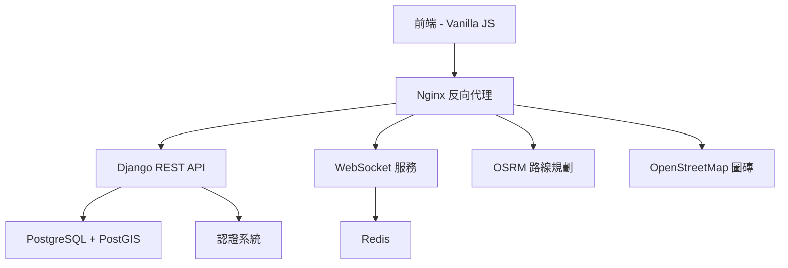
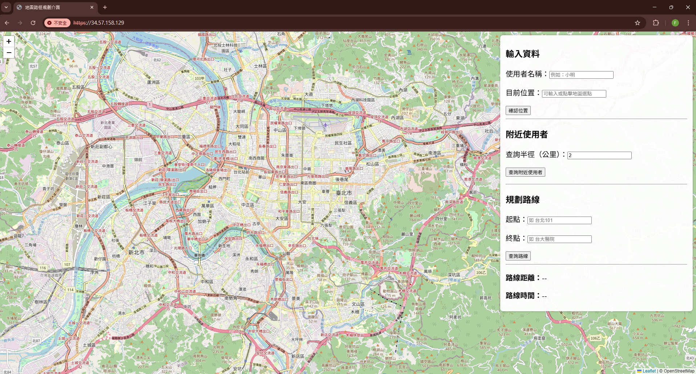
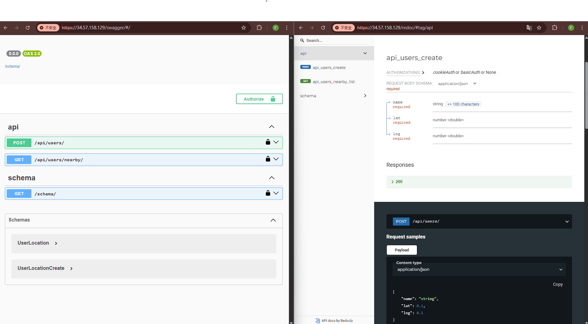

# 🗺️ 台灣導航系統 Taiwan Navigation System

[](https://opensource.org/licenses/MIT)
[](https://www.docker.com/)
[](https://www.djangoproject.com/)
[](https://postgis.net/)

一套現代化的台灣地圖導航與即時通訊平台，採用 Docker 容器化部署，結合地理資訊系統 (GIS) 與即時通訊技術。專為台灣地區設計，提供精確的位置服務、鄰近用戶搜尋、實時聊天和路線規劃功能。

## ✨ 主要功能

- 🔐 **完整認證系統** - 用戶註冊、登入、Token 認證，確保資料安全
- 📍 **智慧定位服務** - 支援地圖點選、地址輸入、GPS 座標多種定位方式
- 👥 **鄰近用戶搜尋** - 基於地理位置的社交功能，可調整搜尋半徑
- 💬 **即時聊天系統** - WebSocket 技術實現的低延遲即時通訊
- 🛣️ **路線規劃導航** - 整合 OSRM 引擎，提供最佳路徑與時間估算
- 🔄 **負載均衡架構** - 多實例部署確保高可用性
- 📱 **響應式設計** - 跨裝置友好的用戶界面
  
## 🏗️ 系統架構



### 🔧 技術棧

| 層級 | 技術 | 用途 |
|------|------|------|
| **前端** | Vanilla JS + Leaflet | 地圖渲染、用戶界面 |
| **代理** | Nginx | 靜態文件服務、負載均衡、反向代理 |
| **後端** | Django + DRF + Channels | REST API、WebSocket、認證 |
| **資料庫** | PostgreSQL + PostGIS | 地理資料存储、用戶資料 |
| **快取** | Redis | WebSocket 通道層、會話存储 |
| **路線** | OSRM | 路線計算引擎 |
| **地圖** | OpenStreetMap | 地圖圖磚服務 |

## 🚀 快速開始

### 系統需求
- Docker 24.0+
- Docker Compose v2.0+
- 8GB+ RAM (用於處理台灣 OSM 數據)
- 10GB+ 可用磁碟空間

### 一鍵部署

```bash
# 1. 複製專案
git clone https://github.com/your-username/taiwan-navigation-system.git
cd taiwan-navigation-system

# 2. 設定環境變數（可選）
cp .env.sample .env
# 編輯 .env 檔案以自訂設定

# 3. 自動化部署
chmod +x setup.sh
./setup.sh
```

### 初始化資料庫

```bash
# 等待所有容器啟動後執行
docker compose exec django-1 python manage.py migrate
```

### 訪問系統

1. 修改 `frontend/app.js` 中的 IP 地址為您的伺服器 IP
2. 開啟瀏覽器訪問 `https://your-ip-address`
3. 註冊新帳號開始使用！

### 📱 API 文檔

- **Swagger UI**: `https://your-ip/swagger/`
- **ReDoc**: `https://your-ip/redoc/`

## 🔑 主要 API 端點

| 端點 | 方法 | 功能 | 認證 |
|------|------|------|------|
| `/api/auth/register/` | POST | 用戶註冊 | ❌ |
| `/api/auth/login/` | POST | 用戶登入 | ❌ |
| `/api/auth/logout/` | POST | 用戶登出 | ✅ |
| `/api/users/` | POST | 設定位置 | ✅ |
| `/api/users/nearby/` | GET | 搜尋附近用戶 | ✅ |


## 🛠️ 開發指南

### 資料來源
- **地圖資料**: [Geofabrik](https://download.geofabrik.de/) 提供的台灣 OSM 資料 (`taiwan-latest.osm.pbf`)
- **路線引擎**: 自動執行 OSRM 預處理流程 (`osrm-extract`, `osrm-partition`, `osrm-customize`)

### 架構說明

#### Nginx 服務功能
- 🌐 **靜態文件服務**: 提供前端資源 (HTML/CSS/JS)
- 🔄 **反向代理**: API 請求轉發到 Django 後端
- ⚡ **WebSocket 代理**: 即時通訊協議升級和轉發
- ⚖️ **負載均衡**: 多 Django 實例的請求分發

#### 開發環境 HTTPS
系統自動生成自簽名憑證，支援基於 IP 的 HTTPS 開發：

| 檔案 | 用途 |
|------|------|
| `certbot/conf/selfsigned/fullchain.pem` | SSL 憑證 |
| `certbot/conf/selfsigned/privkey.pem` | 私鑰 |
| `certbot/conf/selfsigned/openssl.cnf` | 憑證設定 |

### 🧪 測試指令

```bash
# 執行後端測試
docker compose exec django-1 python manage.py test

# 特定應用測試
docker compose exec django-1 python manage.py test geouser
docker compose exec django-1 python manage.py test chat
docker compose exec django-1 python manage.py test authentication
```

### 🐛 除錯指令

```bash
# 查看服務日誌
docker compose logs django-1
docker compose logs nginx
docker compose logs osrm

# 進入容器除錯
docker compose exec django-1 python manage.py shell
```

## 🎥 Demo Video
[](https://www.youtube.com/watch?v=_wN4NqdcgT8) 
點擊上圖可觀看系統實際操作畫面。

##  系統畫面

  
系統首頁介面，顯示台灣地圖與功能控制項。

  
輸入唯一的使用者名稱與座標（可點擊地圖、輸入地址或手動輸入經緯度），位置將顯示於地圖上。

  
輸入查詢半徑（公里），可搜尋並顯示附近其他使用者的位置。

  
點擊地圖上的使用者標記，可開啟對話框進行 WebSocket 即時聊天。

  
輸入起點與終點，系統會在地圖上顯示導航路線、距離與預估開車時間。

<div style="display:flex; gap:10px;">
  
  
  
</div>

以上三張圖展示對同一 API 發出三次請求，經由 Nginx 負載均衡器，分別由不同 Django container 回應處理。

  
Swagger 與 ReDoc 文件介面。

## 🤝 貢獻指南

我們歡迎社群貢獻！請遵循以下步驟：

1. **Fork** 此專案
2. 建立功能分支 (`git checkout -b feature/amazing-feature`)
3. 提交變更 (`git commit -m 'Add amazing feature'`)
4. 推送到分支 (`git push origin feature/amazing-feature`)
5. 開啟 **Pull Request**

### 開發準則
- 遵循 [PEP 8](https://www.python.org/dev/peps/pep-0008/) Python 編碼規範
- 新功能請撰寫對應測試
- 更新相關文檔
- 提交訊息請使用英文並描述清楚

## 📝 更新日誌

### v2.0.0 (2025-07-12)
- ✅ 新增完整用戶認證系統 (註冊/登入/登出)
- ✅ 實作 Token-based 身份驗證
- ✅ 重構資料模型以支援 Django User
- ✅ 強化 API 安全性保護
- ✅ 更新 WebSocket 認證機制

### v1.0.0 
- ✅ 基本地圖導航功能
- ✅ 用戶位置管理
- ✅ 即時聊天系統
- ✅ 負載均衡架構

## 🛣️ 路線圖

- [ ] **多語言支援** - 英文/日文介面
- [ ] **行動應用** - React Native App
- [ ] **進階路線** - 大眾運輸整合
- [ ] **社群功能** - 好友系統、群組聊天
- [ ] **地理圍欄** - 自訂區域提醒
- [ ] **資料分析** - 使用者行為洞察

## 🔗 相關連結

- [OSRM Project](http://project-osrm.org/) - 路線規劃引擎
- [OpenStreetMap](https://www.openstreetmap.org/) - 開源地圖資料
- [PostGIS](https://postgis.net/) - 地理空間資料庫擴展
- [Django Channels](https://channels.readthedocs.io/) - WebSocket 支援

## 📄 授權協議

本專案採用 MIT 授權協議 - 詳見 [LICENSE](LICENSE) 檔案

## 👨‍💻 作者

**Hank Lin** - *初始開發* - [@hanklin0804](https://github.com/hanklin0804)

## 🙏 致謝

- 感謝 [OpenStreetMap](https://www.openstreetmap.org/) 社群提供台灣地圖資料
- 感謝 [Geofabrik](https://www.geofabrik.de/) 提供 OSM 資料下載服務
- 感謝所有開源專案貢獻者

---

⭐ 如果這個專案對您有幫助，請給我們一個 Star！

🐛 發現問題？請到 [Issues](https://github.com/your-username/taiwan-navigation-system/issues) 回報

💡 有想法或建議？歡迎開啟 [Discussions](https://github.com/your-username/taiwan-navigation-system/discussions)
