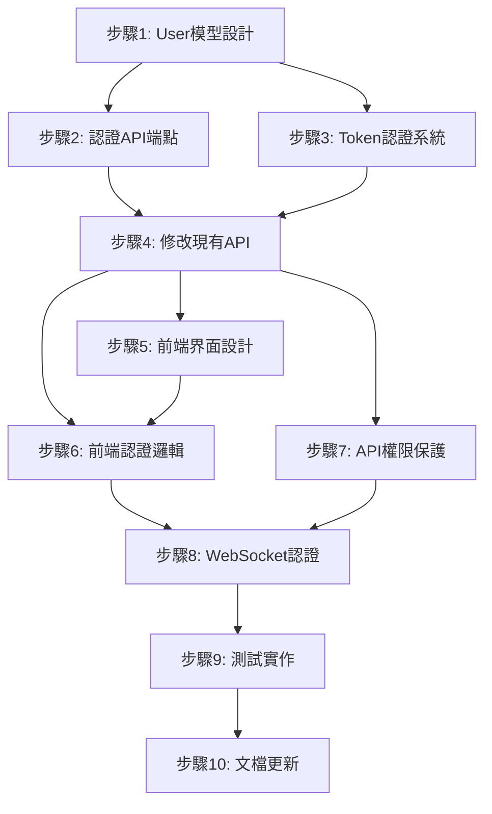

# 台灣導航系統 - 認證功能執行計畫 TODO

## 🎯 專案目標
為台灣導航系統實作完整的使用者認證功能，包含註冊、登入、登出及安全性保護。

**總預估時間**: 25-35 小時 (3-5 工作天)

---

## 📋 任務依賴關係分析

---

## 🚀 執行階段劃分

### 🔴 第一階段：後端核心建置 (6-8 小時)
**目標**: 建立認證系統基礎架構

#### Phase 1A: 資料模型重構 (必須優先)
- [ ] **1.1** 🔒 **[CRITICAL]** 資料庫備份
  - 備份現有 PostgreSQL 資料
  - 時間: 30分鐘
  - 檔案: 無 (備份檔案)

- [ ] **1.2** 📊 Django User 模型擴展
  - 分析現有 UserLocation 模型
  - 設計 User Profile 或直接使用 Django User
  - 時間: 1 小時
  - 檔案: `backend/geouser/models.py`

- [ ] **1.3** 🔄 UserLocation 模型修改
  - 將 `name` 欄位改為 `user` ForeignKey
  - 建立資料遷移檔案
  - 時間: 1-1.5 小時
  - 檔案: `backend/geouser/models.py`, migrations

#### Phase 1B: 認證 App 建立 (可與1A並行部分工作)
- [ ] **2.1** 🏗️ 建立 authentication app
  - `python manage.py startapp authentication`
  - 時間: 15分鐘
  - 檔案: `backend/authentication/`

- [ ] **2.2** 🔐 實作註冊 API
  - 建立 RegisterView 和 Serializer
  - 時間: 1.5 小時
  - 檔案: `backend/authentication/views.py`, `serializers.py`

- [ ] **2.3** 🚪 實作登入 API  
  - 建立 LoginView
  - 時間: 1 小時
  - 檔案: `backend/authentication/views.py`

- [ ] **2.4** 👤 實作使用者資訊 API
  - 建立 UserProfileView
  - 時間: 45分鐘
  - 檔案: `backend/authentication/views.py`

- [ ] **2.5** 🔗 URL 路由設定
  - 設定 authentication app URLs
  - 整合到主 URLs
  - 時間: 30分鐘
  - 檔案: `backend/authentication/urls.py`, `backend/taxi_backend/urls.py`

---

### 🟡 第二階段：認證整合 (4-6 小時)
**目標**: 整合 Token 認證和修改現有 API

#### Phase 2A: Token 認證系統 (優先)
- [ ] **3.1** ⚙️ Django 設定配置
  - 在 settings.py 加入 DRF Token Authentication
  - 配置認證類別
  - 時間: 45分鐘
  - 檔案: `backend/taxi_backend/settings.py`

- [ ] **3.2** 🎫 Token 生成機制
  - 實作登入時 token 生成
  - 實作登出時 token 刪除
  - 時間: 1 小時
  - 檔案: `backend/authentication/views.py`

- [ ] **3.3** 🔄 Token 刷新功能
  - 實作 token 過期和刷新
  - 時間: 1 小時
  - 檔案: `backend/authentication/views.py`

#### Phase 2B: 現有 API 修改 (可與3.1-3.2並行)
- [ ] **4.1** 📍 修改 UserLocation API
  - 更新 UserLocationCreateView 使用認證用戶
  - 修改相關 Serializer
  - 時間: 1.5 小時
  - 檔案: `backend/geouser/views.py`, `serializers.py`

- [ ] **4.2** 🔍 修改 NearbyUser API
  - 更新 NearbyUserSearchView
  - 時間: 1 小時
  - 檔案: `backend/geouser/views.py`

- [ ] **4.3** 💬 修改 Chat 模型
  - 更新 Message 模型關聯
  - 時間: 45分鐘
  - 檔案: `backend/chat/models.py`

---

### 🟢 第三階段：前端界面開發 (7-9 小時)
**目標**: 建立使用者友善的認證界面

#### Phase 3A: UI 設計 (可並行)
- [ ] **5.1** 📝 登入表單設計
  - HTML 結構和 CSS 樣式
  - 響應式設計
  - 時間: 1.5 小時
  - 檔案: `frontend/index.html`, `frontend/style.css`

- [ ] **5.2** 📋 註冊表單設計
  - HTML 結構和 CSS 樣式
  - 表單驗證提示
  - 時間: 1.5 小時
  - 檔案: `frontend/index.html`, `frontend/style.css`

- [ ] **5.3** 🎨 界面整合優化
  - 統一設計風格
  - 動畫效果
  - 時間: 1 小時
  - 檔案: `frontend/style.css`

#### Phase 3B: JavaScript 邏輯 (需等待API完成)
- [ ] **6.1** 🔐 登入功能實作
  - 登入表單處理
  - API 呼叫和錯誤處理
  - 時間: 1.5 小時
  - 檔案: `frontend/app.js`

- [ ] **6.2** 📝 註冊功能實作
  - 註冊表單處理
  - 表單驗證
  - 時間: 1.5 小時
  - 檔案: `frontend/app.js`

- [ ] **6.3** 💾 Token 管理
  - localStorage 存取
  - 自動登入檢查
  - Token 過期處理
  - 時間: 1 小時
  - 檔案: `frontend/app.js`

- [ ] **6.4** 🔄 現有功能整合
  - 修改現有 API 呼叫加入 headers
  - 更新 WebSocket 連線邏輯
  - 時間: 1 小時
  - 檔案: `frontend/app.js`

---

### 🛡️ 第四階段：安全性強化 (5-7 小時)
**目標**: 加強 API 安全性和 WebSocket 認證

#### Phase 4A: API 權限保護 (可並行)
- [ ] **7.1** 🔒 Geouser API 權限
  - 加入 IsAuthenticated 權限
  - 實作用戶資料隔離
  - 時間: 1.5 小時
  - 檔案: `backend/geouser/views.py`

- [ ] **7.2** 💬 Chat API 權限  
  - 保護聊天相關 API
  - 時間: 45分鐘
  - 檔案: `backend/chat/views.py`

#### Phase 4B: WebSocket 認證 (複雜度高)
- [ ] **8.1** 🔌 WebSocket Token 認證
  - 修改 ChatConsumer 驗證機制
  - 實作 token 驗證中間件
  - 時間: 2 小時
  - 檔案: `backend/chat/consumers.py`

- [ ] **8.2** 🔗 WebSocket 路由更新
  - 更新 WebSocket URL 模式
  - 整合認證檢查
  - 時間: 1 小時
  - 檔案: `backend/chat/routing.py`

- [ ] **8.3** 🖥️ 前端 WebSocket 整合
  - 更新前端 WebSocket 連線邏輯
  - 加入 token 傳遞
  - 時間: 1.5 小時
  - 檔案: `frontend/app.js`

---

### 🧪 第五階段：測試與文檔 (4-6 小時)
**目標**: 確保功能穩定性和完善文檔

#### Phase 5A: 測試實作 (可並行)
- [ ] **9.1** 🧪 認證 API 單元測試
  - 測試註冊、登入、登出功能
  - 時間: 2 小時
  - 檔案: `backend/authentication/tests.py`

- [ ] **9.2** 🧪 整合測試
  - 測試 API 權限保護
  - 測試 WebSocket 認證
  - 時間: 1.5 小時
  - 檔案: `backend/geouser/tests.py`

- [ ] **9.3** 🧪 前端測試
  - 手動測試登入流程
  - 跨瀏覽器兼容性測試
  - 時間: 1 小時

#### Phase 5B: 文檔更新
- [ ] **10.1** 📚 API 文檔更新
  - 更新 Swagger/OpenAPI 文檔
  - 時間: 45分鐘

- [ ] **10.2** 📋 使用說明文檔
  - 更新 CLAUDE.md
  - 撰寫認證使用指南
  - 時間: 45分鐘
  - 檔案: `CLAUDE.md`

---

## ⚡ 並行執行建議

### 可並行的任務組合:

**🔥 第一天 (8小時)**:
- **上午**: 1.1 → 1.2 → 1.3 (資料模型，4小時)
- **下午**: 2.1 → 2.2 → 2.3 → 2.4 → 2.5 (認證API，4小時)

**🔥 第二天 (8小時)**:
- **上午**: 3.1 → 3.2 → 3.3 || 4.1 (Token + UserLocation修改，4小時)
- **下午**: 4.2 → 4.3 → 5.1 → 5.2 (API修改 + UI設計，4小時)

**🔥 第三天 (8小時)**:
- **上午**: 5.3 → 6.1 → 6.2 (UI優化 + 前端邏輯，4小時)  
- **下午**: 6.3 → 6.4 → 7.1 → 7.2 (Token管理 + API權限，4小時)

**🔥 第四天 (7小時)**:
- **上午**: 8.1 → 8.2 (WebSocket認證，3小時)
- **下午**: 8.3 → 9.1 → 9.2 (前端整合 + 測試，4小時)

**🔥 第五天 (4小時)**:
- **上午**: 9.3 → 10.1 → 10.2 (測試 + 文檔，4小時)

---

## 🎯 每日檢查點

### Day 1 結束檢查:
- [ ] 資料庫模型已更新
- [ ] 認證 API 端點可運作
- [ ] 可以創建新用戶和登入

### Day 2 結束檢查:
- [ ] Token 認證系統運作
- [ ] 現有 API 已整合認證
- [ ] 前端基本界面完成

### Day 3 結束檢查:
- [ ] 前端認證流程完整
- [ ] API 權限保護生效
- [ ] 基本功能測試通過

### Day 4 結束檢查:
- [ ] WebSocket 認證運作
- [ ] 所有測試通過
- [ ] 系統完整功能可用

### Day 5 結束檢查:
- [ ] 文檔更新完成
- [ ] 部署準備就緒
- [ ] 功能驗收完成

---

## 🚨 風險控制檢查點

### 高風險任務提醒:
- **1.3 資料遷移**: 務必先備份，測試遷移腳本
- **8.1 WebSocket認證**: 複雜度高，預留額外時間
- **6.4 前端整合**: 可能需要重構現有邏輯

### 每階段完成後必須檢查:
1. **功能測試**: 新功能運作正常
2. **回歸測試**: 現有功能未受影響  
3. **安全檢查**: 認證機制運作正確
4. **性能檢查**: 系統響應時間正常

---

## 📊 進度追蹤

**整體進度**: ⬜⬜⬜⬜⬜⬜⬜⬜⬜⬜ 0% (0/50 子任務)

**階段進度**:
- 🔴 第一階段 (後端核心): ⬜⬜⬜⬜⬜⬜⬜⬜ 0% (0/8)
- 🟡 第二階段 (認證整合): ⬜⬜⬜⬜⬜⬜ 0% (0/6)  
- 🟢 第三階段 (前端界面): ⬜⬜⬜⬜⬜⬜⬜ 0% (0/7)
- 🛡️ 第四階段 (安全性): ⬜⬜⬜⬜⬜ 0% (0/5)
- 🧪 第五階段 (測試文檔): ⬜⬜⬜⬜⬜ 0% (0/5)

---

*執行計畫建立時間: 2025-07-12*  
*預計開始時間: 待確認*  
*預計完成時間: 開始後 3-5 工作天*