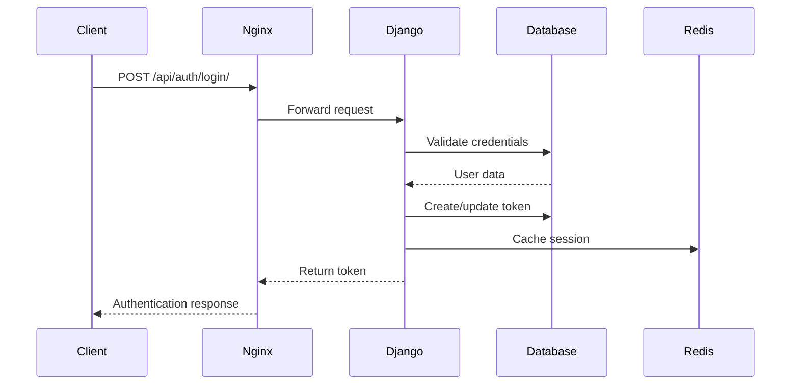
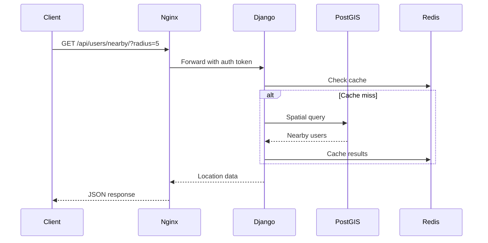
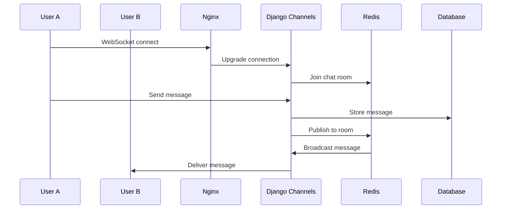

# 🏗️ 系統架構 System Architecture

本文檔詳細說明台灣導航系統的技術架構、設計決策和組件交互。

## 📋 系統概覽

台灣導航系統是一個現代化的地理資訊與即時通訊平台，採用微服務架構設計，支援水平擴展和高可用性。

```
┌─────────────────────────────────────────────────────────────┐
│                        使用者介面層                          │
├─────────────────────────────────────────────────────────────┤
│  Web Browser │ Mobile App │ Desktop App │ Third-party API   │
└─────────────────────────────────────────────────────────────┘
                              │
                              ▼
┌─────────────────────────────────────────────────────────────┐
│                        負載均衡層                            │
├─────────────────────────────────────────────────────────────┤
│                    Nginx Load Balancer                     │
│                   • SSL 終端處理                            │
│                   • 靜態檔案服務                            │
│                   • 反向代理                               │
│                   • WebSocket 升級                         │
└─────────────────────────────────────────────────────────────┘
                              │
                              ▼
┌─────────────────────────────────────────────────────────────┐
│                        應用程式層                            │
├─────────────────────────────────────────────────────────────┤
│  Django 1  │  Django 2  │  Django 3  │     OSRM Server    │
│  • REST API │  • REST API │  • REST API │  • 路線計算      │
│  • WebSocket│  • WebSocket│  • WebSocket│  • 距離計算      │
│  • 認證     │  • 認證     │  • 認證     │  • 時間估算      │
└─────────────────────────────────────────────────────────────┘
                              │
                              ▼
┌─────────────────────────────────────────────────────────────┐
│                          資料層                             │
├─────────────────────────────────────────────────────────────┤
│     PostgreSQL + PostGIS     │         Redis Cluster       │
│     • 用戶資料               │         • Session 存儲       │
│     • 地理資料               │         • WebSocket 通道     │
│     • 聊天記錄               │         • 快取資料           │
└─────────────────────────────────────────────────────────────┘
```

## 🔧 技術棧

### 前端技術
```
Vanilla JavaScript + Leaflet.js
├── 地圖渲染：Leaflet.js
├── HTTP 請求：Fetch API
├── WebSocket：原生 WebSocket API
├── 狀態管理：localStorage + 全域變數
└── 樣式：原生 CSS3
```

### 後端技術
```
Django 4.x Ecosystem
├── 核心框架：Django 4.x
├── API 框架：Django REST Framework
├── WebSocket：Django Channels
├── 認證：Token Authentication
├── 文檔：drf-spectacular (OpenAPI)
└── CORS：django-cors-headers
```

### 資料庫技術
```
PostgreSQL + PostGIS
├── 關聯資料：PostgreSQL 15
├── 地理資料：PostGIS 3.3
├── 索引：GIST, B-tree
├── 快取：Redis 7
└── 連線池：pgbouncer (可選)
```

### 基礎設施
```
Docker + Docker Compose
├── 容器化：Docker 24+
├── 編排：Docker Compose
├── 反向代理：Nginx Alpine
├── SSL：自簽名/Let's Encrypt
└── 監控：Docker logs
```

## 🏛️ 架構模式

### 1. 分層架構 (Layered Architecture)

```
┌─────────────────┐
│   Presentation  │ ← 前端、API 端點
├─────────────────┤
│    Business     │ ← 業務邏輯、服務層
├─────────────────┤
│  Data Access    │ ← ORM、資料庫操作
├─────────────────┤
│   Infrastructure│ ← 外部服務、檔案系統
└─────────────────┘
```

### 2. 微服務分離

| 服務 | 職責 | 技術 |
|------|------|------|
| **Web Server** | 靜態檔案、反向代理 | Nginx |
| **API Gateway** | 路由、認證、限流 | Django + DRF |
| **User Service** | 用戶管理、認證 | Django Auth |
| **Location Service** | 位置管理、地理查詢 | PostGIS |
| **Chat Service** | 即時通訊 | Django Channels |
| **Routing Service** | 路線規劃 | OSRM |

### 3. 事件驅動架構

```
WebSocket 事件流:
Client ──→ Nginx ──→ Django Channels ──→ Redis ──→ Database
   ▲                                          │
   └──────────── Response ←──────────────────┘
```

## 🔄 資料流

### 1. 用戶認證流程



### 2. 位置查詢流程



### 3. 即時聊天流程



## 💾 資料庫設計

### 核心資料模型

```sql
-- 用戶模型 (Django 內建)
User {
    id: bigint PK
    username: varchar(150) UNIQUE
    email: varchar(254)
    password: varchar(128)
    date_joined: timestamp
    last_login: timestamp
}

-- 用戶位置
UserLocation {
    id: bigint PK
    user_id: bigint FK -> User.id
    location: geometry(Point,4326)  -- PostGIS
    created_at: timestamp
}

-- 聊天訊息
Message {
    id: bigint PK
    sender_id: bigint FK -> User.id
    recipient_id: bigint FK -> User.id
    content: text
    timestamp: timestamp
}

-- 認證 Token
Token {
    key: varchar(40) PK
    user_id: bigint FK -> User.id
    created: timestamp
}
```

### 地理索引策略

```sql
-- 空間索引 (自動建立)
CREATE INDEX idx_userlocation_location ON geouser_userlocation 
USING GIST (location);

-- 複合索引
CREATE INDEX idx_message_participants ON chat_message 
(sender_id, recipient_id, timestamp);

-- 部分索引
CREATE INDEX idx_active_tokens ON authtoken_token (user_id) 
WHERE created > NOW() - INTERVAL '30 days';
```

## 🚀 性能優化

### 1. 快取策略

```python
# Redis 快取層級
CACHE_LEVELS = {
    'L1': 'Application Cache',      # Django cache framework
    'L2': 'Database Query Cache',   # Redis query cache
    'L3': 'HTTP Response Cache',    # Nginx cache
    'L4': 'CDN Cache',             # 外部 CDN (可選)
}
```

### 2. 資料庫優化

```sql
-- 分割資料表 (按時間)
CREATE TABLE chat_message_2025_01 PARTITION OF chat_message
FOR VALUES FROM ('2025-01-01') TO ('2025-02-01');

-- 索引優化
EXPLAIN ANALYZE 
SELECT * FROM geouser_userlocation 
WHERE ST_DWithin(location, ST_Point(121.5654, 25.0330), 5000);
```

### 3. 負載均衡

```nginx
# Nginx 負載均衡設定
upstream django_backend {
    least_conn;
    server django-1:8000 max_fails=3 fail_timeout=30s;
    server django-2:8000 max_fails=3 fail_timeout=30s;
    server django-3:8000 max_fails=3 fail_timeout=30s;
}
```

## 🔒 安全架構

### 1. 認證與授權

```
Authentication Flow:
1. Token-based authentication
2. HTTPS/WSS encryption
3. CORS policy enforcement
4. Rate limiting per IP/user
```

### 2. 資料安全

```python
# 敏感資料處理
SECURITY_MEASURES = {
    'passwords': 'PBKDF2 hashing',
    'tokens': 'Random 40-char strings', 
    'api_keys': 'Environment variables',
    'database': 'SSL connections',
    'logs': 'Sensitive data filtering'
}
```

### 3. 網路安全

```
Network Security:
├── SSL/TLS 加密傳輸
├── 防火牆規則設定
├── DDoS 攻擊防護
├── SQL 注入防護
└── XSS 攻擊防護
```

## 📊 監控與日誌

### 1. 應用程式監控

```python
# Django 日誌設定
LOGGING = {
    'version': 1,
    'handlers': {
        'file': {
            'class': 'logging.FileHandler',
            'filename': '/app/logs/django.log',
        },
        'console': {
            'class': 'logging.StreamHandler',
        }
    },
    'loggers': {
        'django': {'level': 'INFO'},
        'geouser': {'level': 'DEBUG'},
        'chat': {'level': 'DEBUG'},
    }
}
```

### 2. 系統監控

```bash
# Docker 容器監控
docker stats --format "table {{.Container}}\t{{.CPUPerc}}\t{{.MemUsage}}\t{{.NetIO}}"

# 資料庫監控
SELECT * FROM pg_stat_activity WHERE state = 'active';
SELECT * FROM pg_stat_user_tables WHERE relname = 'geouser_userlocation';
```

## 🔧 部署策略

### 1. 容器編排

```yaml
# docker-compose.yml 重點設定
services:
  nginx:
    deploy:
      replicas: 1
      restart_policy:
        condition: on-failure
        max_attempts: 3

  django-1:
    deploy:
      replicas: 3
      resources:
        limits:
          memory: 512M
          cpus: '0.5'
```

### 2. 環境管理

```
Environments:
├── Development: Docker Compose (單機)
├── Staging: Docker Swarm (多機)
├── Production: Kubernetes (雲端)
└── Testing: CI/CD Pipeline
```

### 3. 備份策略

```bash
# 自動化備份腳本
#!/bin/bash
# 資料庫備份
docker compose exec db pg_dump -U user db > "backup_$(date +%Y%m%d_%H%M%S).sql"

# 檔案備份
tar -czf "files_backup_$(date +%Y%m%d).tar.gz" osm_data/ certbot/

# 上傳到雲端儲存
aws s3 cp backup_*.sql s3://your-backup-bucket/
```

## 🚧 擴展規劃

### 1. 水平擴展

```
Scaling Strategy:
├── API 層：增加 Django 實例
├── 資料庫：讀寫分離、分片
├── 快取：Redis Cluster
├── 檔案：物件儲存 (S3/MinIO)
└── 負載均衡：雲端 Load Balancer
```

### 2. 功能擴展

```
Future Features:
├── 微服務拆分：獨立部署
├── 訊息佇列：Celery + RabbitMQ
├── 搜尋引擎：Elasticsearch
├── 大數據：Apache Kafka
└── 機器學習：TensorFlow Serving
```

## 📈 性能指標

### 1. 關鍵指標 (KPIs)

| 指標 | 目標值 | 監控方式 |
|------|--------|----------|
| API 回應時間 | < 200ms | APM 工具 |
| 資料庫查詢 | < 100ms | pg_stat_statements |
| WebSocket 延遲 | < 50ms | 自定義監控 |
| 系統可用性 | > 99.9% | 健康檢查 |

### 2. 容量規劃

```
Estimated Capacity:
├── 同時線上用戶：10,000
├── API 請求/秒：1,000
├── WebSocket 連線：5,000
├── 資料庫大小：100GB
└── 儲存空間：500GB
```

## 🔗 外部整合

### 1. 第三方服務

```
External Dependencies:
├── 地圖資料：OpenStreetMap
├── 路線規劃：OSRM
├── 郵件服務：SMTP (可選)
├── 檔案儲存：S3 (可選)
└── 監控服務：Sentry (可選)
```

### 2. API 整合

```python
# 外部 API 整合範例
EXTERNAL_APIS = {
    'weather': 'OpenWeatherMap API',
    'geocoding': 'Nominatim API', 
    'places': 'Overpass API',
    'traffic': 'Custom traffic API'
}
```

## 📞 技術支援

如需架構相關協助：

1. 查看 [安裝指南](installation.md)
2. 閱讀 [API 文檔](api.md)  
3. 建立 [技術討論](https://github.com/your-username/taiwan-navigation-system/discussions)